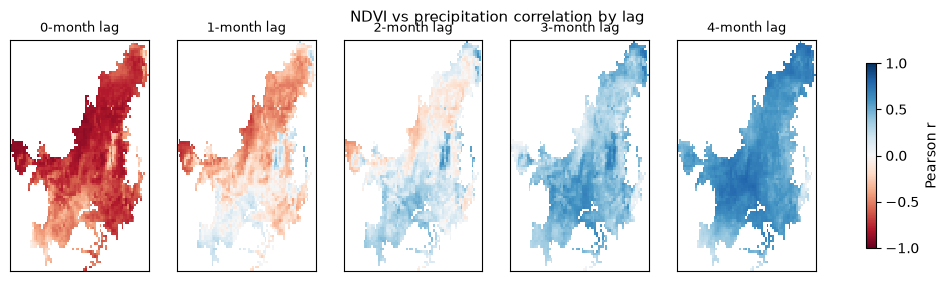
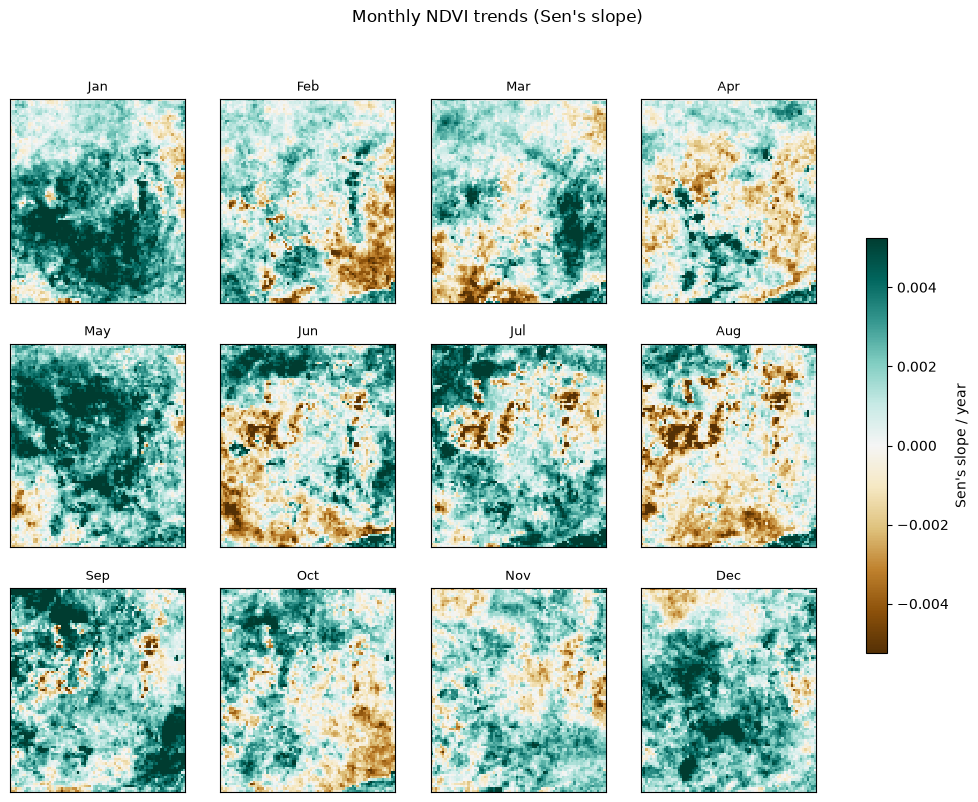
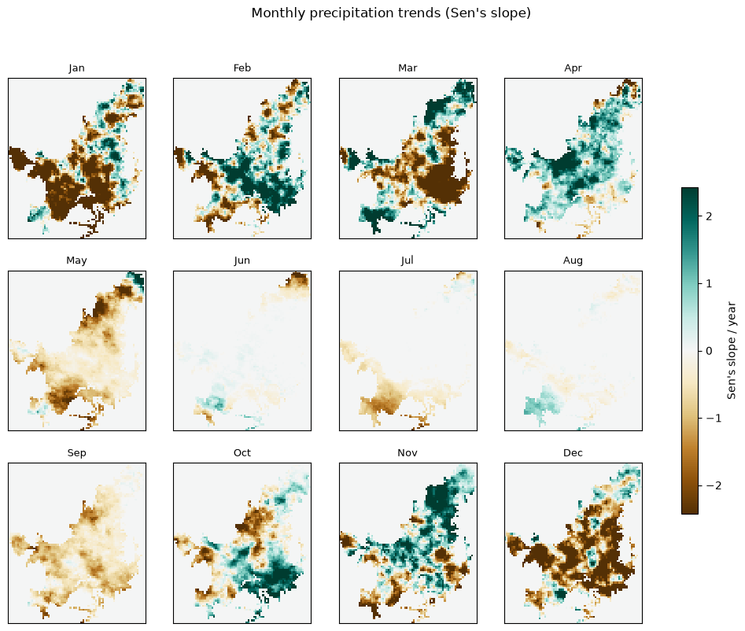

# Spatio-Temporal Correlation Between Precipitation and Vegetation Dynamics in the Brazil-Cerrado Region

> Does vegetation health in Brazil's Cerrado biome respond to rainfall immediately, or with a delay? A 24-year precipitation/NDVI pipeline rebuilt to run locally end-to-end.

---

## Overview

Scientific evidence suggests vegetation dynamics can alter regional climate by disrupting moisture recycling and atmospheric circulation, potentially intensifying or suppressing local rainfall. This project tests that relationship empirically: does the frequency of precipitation across the Cerrado correlate spatially — immediately or with a delay — with vegetation health (NDVI)?

**Key outputs:**
- A 24-year (2001-2024), pixel-aligned precipitation/NDVI dataset for the Cerrado
- Per-pixel lag correlation maps (0-4 months) between precipitation and NDVI
- Per-pixel Sen's slope trend maps, by calendar month, for both variables

---

## Background & Motivation

> How has the frequency of precipitation in Brazil's Cerrado region changed between 2001-2024, and how does this spatially correlate with vegetation dynamics (health)?

**Hypothesis:** A decrease in precipitation frequency in the Cerrado between 2001-2024 will show a strong positive spatial correlation with a decline in vegetation health.

Empirical studies systematically linking precipitation change to spatial patterns of vegetation health remain limited, despite the Cerrado experiencing both rising extreme rainfall events and rapid forest loss over the past 20 years.

---

## Methodology

### Data sources

| Dataset | Source | Notes |
|---|---|---|
| CHIRPS v2.0 precipitation | [UCSB Climate Hazards Center](https://www.chc.ucsb.edu/data/chirps) | daily, 0.25° resolution, 2001-2024 |
| MODIS NDVI | [MOD09GA](https://developers.google.com/earth-engine/datasets/catalog/MODIS_061_MOD09GA) via Google Earth Engine | computed from surface reflectance bands, monthly composites, ~25km export scale |
| Cerrado boundary | [TerraBrasilis](https://terrabrasilis.dpi.inpe.br/), INPE | state-level biome shapefile |

### Approach

Five stages, each a standalone script. Run in order — each depends on the previous stage's output.

| Stage | Script | What it does |
|---|---|---|
| 1 | `precipitation_download.py` | Downloads CHIRPS daily precipitation, clips it to the Cerrado biome shapefile |
| 2 | `ndvi_monthly.py` | Computes monthly mean MODIS NDVI over the Cerrado via Earth Engine, one GeoTIFF per month (288 total) |
| 3 | `ndvi_stitch.py` | Combines the 288 monthly GeoTIFFs into a single NDVI time series |
| 4 | `analysis_correlation.py` | Aligns the NDVI and precipitation grids, computes per-pixel lag correlation (0-4 months) |
| 5 | `analysis_trends.py` | Computes per-pixel Sen's slope trends by calendar month, for both variables |

`ndvi_snapshot.py` is a smaller standalone script (single-date NDVI fetch) used to validate Earth Engine access before building the full monthly pipeline — not part of the main pipeline.

### Key assumptions & limitations

- **Grid alignment is approximate, not exact.** CHIRPS (native 0.25°) and the NDVI export (~25km scale) don't share grid points, so NDVI is interpolated (`xarray.interp_like`) onto the CHIRPS grid rather than truly co-located pixel-for-pixel.
- **"Precipitation" in the correlation/trend analysis means monthly total rainfall**, not a separate extreme-event-frequency index — the team's original presentation also looked at extreme-day frequency (P95 threshold) separately, which this rebuild doesn't reproduce.
- **NDVI is computed from MOD09GA surface reflectance**, not the standard pre-built MOD13Q1 NDVI product — this matches what the original team used, but is less quality-controlled (no built-in cloud/QA masking).
- Earth Engine's per-request payload limit (10MB) means the Cerrado boundary geometry has to be simplified before use as a clip mask — at coarse export scales this is a reasonable trade-off, but it does lose some boundary precision.

---

## Results

**NDVI responds to precipitation with a delay, not immediately.** Correlating monthly precipitation against NDVI at lags of 0-4 months shows a clear shift from strongly negative (immediate) to strongly positive (delayed):

| Lag | 0 months | 1 month | 2 months | 3 months | 4 months |
|---|---|---|---|---|---|
| Mean correlation (r) | -0.66 | -0.21 | +0.11 | +0.41 | +0.58 |



This matches the ecological-memory interpretation from the team's original analysis: the biome's vegetation relies on stored soil moisture rather than reacting to rainfall immediately, so the strongest positive vegetation response appears 3-4 months after the rain that triggered it.

**Trends vary by month and aren't always coupled.** Per-pixel Sen's slope trends (2001-2024), computed separately for each calendar month:




January stands out: precipitation is declining there while NDVI is increasing — a vegetation adaptation or land-use signal rather than a simple rainfall-driven response. June-August show a comparatively flat precipitation trend (dry season), consistent with the original team's observation that NDVI decline in that period reflects degradation/fire activity rather than rainfall change.

---

## How to Run

```bash
git clone https://github.com/alexadxms/cerrado-precipitation-vegetation.git
cd cerrado-precipitation-vegetation

python3 -m venv .venv
source .venv/bin/activate
pip install -r requirements.txt
```

```bash
python precipitation_download.py   # stage 1
python ndvi_monthly.py             # stage 2 — slow; ~288 Earth Engine requests
python ndvi_stitch.py              # stage 3
python analysis_correlation.py     # stage 4
python analysis_trends.py          # stage 5
```

Stage 2 is resumable — already-downloaded months are skipped, so it's safe to re-run if interrupted.

### Requirements

- Python 3.10+
- xarray, rioxarray, zarr, s3fs, geopandas, dask, scipy, matplotlib
- `earthengine-api` and `geemap` — needs a free Google Earth Engine account with a registered Cloud project (only for stages 2 and `ndvi_snapshot.py`; stage 1 doesn't need it)
- The first run of `ee.Authenticate()` opens a browser sign-in; credentials are cached after that

---

## What I Learned

The original Colab notebooks referenced a precipitation source (`s3://chirps-zarr/...`) that turned out not to exist as a public bucket — confirmed directly via `s3fs` (`NoSuchBucket`), not just a typo. Rebuilding stage 1 meant finding the actual official CHIRPS distribution (UCSB's HTTPS server, yearly NetCDF files) and substituting it. The same rebuild also surfaced a second, more dangerous bug: the original latitude slice assumed descending order, but CHIRPS stores latitude ascending — this fails silently (an empty array, no error) rather than crashing, which is the kind of bug that's easy to ship without noticing.

On the Earth Engine side, exporting NDVI clipped to the full-resolution Cerrado state-boundary shapefile blew past Earth Engine's 10MB request-size limit — simplifying the polygon's vertex count before using it as a clip mask fixed it, and dropping the export scale to ~25km (computing the monthly mean server-side first) made the full 288-month pull tractable instead of hitting rate limits.

---

## References

- Funk, C., Peterson, P., Landsfeld, M., et al. (2015). *The climate hazards infrared precipitation with stations — a new environmental record for monitoring extremes*. Scientific Data. https://doi.org/10.1038/sdata.2015.66
- TerraBrasilis, INPE — Cerrado biome boundary shapefile.

---
